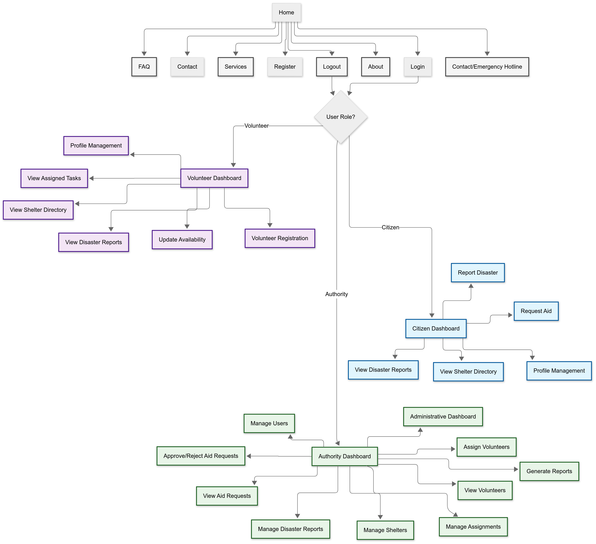

# Disaster Response Information System (DRIS)

**Name:** AKASHDEEP SINGH  
**Student ID:** 24072095

## Overview
DRIS is a Django-based web application commissioned by NADMA to improve disaster response coordination in Malaysia. It supports three user roles: Citizens, Volunteers, and Authorities, each with tailored features for reporting, aid, volunteering, and management.

## Features
- **Role-based Authentication:** Citizens, Volunteers, Authorities
- **Disaster Reporting:** Citizens report disasters (type, GPS, severity, timestamp)
- **Aid Requests:** Citizens request food, shelter, or rescue
- **Volunteer Registration:** Volunteers register skills and availability
- **Volunteer Assignment:** Authorities assign volunteers to aid requests
- **Shelter Directory:** All users view real-time shelter info
- **Admin Dashboard:** Authorities manage users, reports, shelters, assignments
- **Real-time Updates:** Disaster reports and shelter directory auto-refresh
- **Secure Access:** All views protected by login and role-based decorators

## Navigation Structure
- **Disaster Reports:** View/filter all reports
- **Request Aid:** Citizens submit aid requests
- **Volunteer Registration:** Volunteers register skills/availability
- **Shelter Directory:** View all shelters and availability
- **Admin Dashboard:** Authorities manage all data
- **Volunteers:** Authorities view all volunteers
- **Assign Volunteer:** Authorities assign volunteers to aid requests

## How to Run
1. Install dependencies:
   ```
   pip install django
   ```
2. Run migrations:
   ```
   python manage.py makemigrations
   python manage.py migrate
   ```
3. Create a superuser:
   ```
   python manage.py createsuperuser
   ```
4. Start the server:
   ```
   python manage.py runserver
   ```
5. Access the app at [http://localhost:8000/](http://localhost:8000/)

## File Structure
- `core/models.py` – Data models (User, DisasterReport, AidRequest, Shelter, VolunteerAssignment)
- `core/views.py` – Views for all features (role-based access)
- `core/forms.py` – Forms for aid requests, filtering
- `core/forms_volunteer.py` – Volunteer registration form
- `core/templates/core/` – All HTML templates
- `core/urls.py` – App URL routing
- `DRIS_Project/settings.py` – Project settings

## Navigation Diagram (Text)
```
Citizen:
  Home → Disaster Reports (view/filter)
  Home → Submit Disaster Report
  Home → Request Aid
  Home → View Shelter Directory

Volunteer:
  Home → Disaster Reports (view/filter)
  Home → Register Skills/Availability
  Home → View Shelter Directory

Authority:
  Home → Admin Dashboard
    ├─ Manage Users
    ├─ Manage Disaster Reports
    ├─ Manage Shelters
    ├─ Manage Assignments
    ├─ View Volunteers
    └─ Assign Volunteers
  Home → Disaster Reports (view/filter)
  Home → View Shelter Directory
```

## Navigation Flow



## Homepage


---

For any questions or further customization, contact: AKASHDEEP SINGH (24072095)
